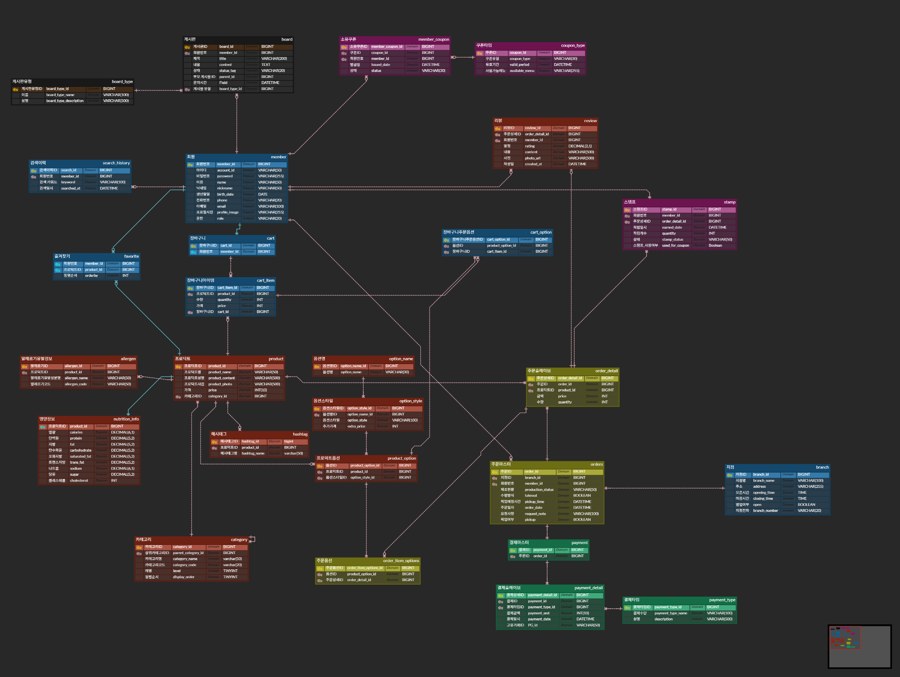
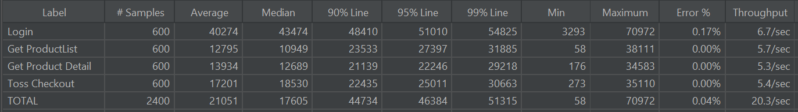
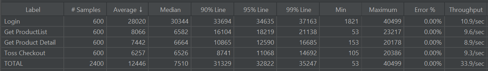
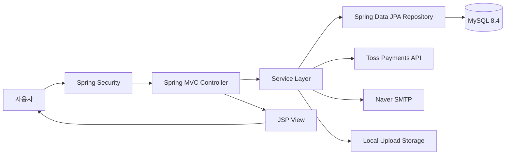

# CodePresso Cafe Platform

카페 온라인 주문 및 관리 플랫폼 시스템

## 프로젝트 소개

CodePresso는 카페 운영을 위한 종합 웹 플랫폼입니다. 
<br>고객은 온라인으로 메뉴를 주문하고, 리뷰를 작성하며, 쿠폰을 활용할 수 있습니다. 
<br>관리자는 상품, 주문, 회원, 지점 등을 효율적으로 관리할 수 있습니다.
<br>본 프로젝트는 총 5명이 함께 진행한 팀 프로젝트입니다.


<br>


## 주요 기능 시연

### 메뉴 검색, 즐겨찾기, 랜덤 메뉴 추천

메뉴를 검색하고 원하는 상품을 즐겨찾기에 추가할 수 있으며, 랜덤 메뉴 추천 기능을 통해 새로운 메뉴를 탐색할 수 있습니다.


<br>

### 고객센터 메뉴

고객센터 메뉴에서 공지사항과 게시판을 확인하고, 사용자가 필요한 문의 흐름으로 이동할 수 있습니다.


<br>

### 장바구니 담기

상품 상세 화면에서 옵션을 선택하고 장바구니에 담아 주문 전 선택 내역을 확인할 수 있습니다.


<br>

### 상품 주문 과정

장바구니에 담긴 상품을 기반으로 주문 정보를 확인하고 결제 단계까지 이어지는 주문 흐름을 보여줍니다.


<br>


## 최종 ERD 설계

총 27개의 테이블로 구성된 최종 ERD입니다. 회원, 상품, 옵션, 장바구니, 주문, 결제, 리뷰, 쿠폰, 게시판 등 카페 주문 플랫폼의 핵심 도메인을 분리하고 각 테이블 간 관계를 설계했습니다.



<br>


## 핵심 기여 요약

- 27개 엔티티 기반 데이터 모델링 및 상품/옵션 정규화 설계
- Toss Payments 기반 주문/결제 파이프라인 구축
- Spring Security 기반 인증/인가 및 RBAC 권한 제어 구현
- 마이페이지, 게시판, 즐겨찾기 페이지의 JSP/CSS 화면 및 사용자 흐름 구현
- JMeter 부하 테스트 기반 병목 분석 및 응답 경로 최적화
- 결제 성공 후 스탬프 적립 로직을 주문 커밋 이후 `@Async`로 분리


<br>


## 개인 담당 및 기여 내용

백엔드와 프런트엔드 개발을 담당하며, 데이터 모델링, 상품/옵션 정규화, 주문/결제 파이프라인, 회원 인증/검증, 게시판 권한 제어, 성능 병목 분석 등 핵심 도메인 전반을 주도적으로 구현했습니다.

### 역할 및 핵심 구현 성과

- **엔터프라이즈급 데이터 모델링 및 정규화**
  - 요구사항 분석을 바탕으로 27개의 주요 엔티티를 도출하고, 서비스 도메인에 맞는 데이터 모델을 설계했습니다.
  - 상품과 옵션 간 중복 데이터가 발생하던 구조를 다대다(`M:N`) 해소 테이블 기반으로 정규화하여 데이터 정합성과 확장성을 확보했습니다.

- **아키텍처 표준화 및 유지보수성 개선**
  - 핵심 도메인에서 `Entity`와 `DTO`를 분리하여 엔티티가 외부 계층에 직접 노출되지 않도록 구조를 개선했습니다.
  - 전용 `Converter` 레이어를 도입해 변환 로직을 분리하고, 계층 간 결합도를 낮춰 코드 가독성과 유지보수성을 높였습니다.
  - Java 21의 Switch Expression 등 최신 문법을 적용해 반복적인 분기 코드를 줄이고 비즈니스 로직의 표현력을 개선했습니다.

- **보안/결제 풀스택 파이프라인 구현**
  - Toss Payments 결제 위젯을 프런트엔드에 연동하고, 결제 승인 API에서 `paymentKey`, `orderId`, `amount` 값을 검증하도록 구현했습니다.
  - 결제 승인 완료 시 주문서(`Orders`), 주문 상세 항목(`OrdersDetail`), 선택 옵션 정보가 하나의 트랜잭션으로 저장되도록 주문 저장 파이프라인을 구축했습니다.
  - 마이페이지, 실시간 중복 검사, SMTP 이메일 인증, 비밀번호 변경, 게시판 `ADMIN` 권한 제어까지 인증/인가 흐름을 풀스택으로 구현했습니다.

### 상세 기술 기여

- **데이터 정규화 및 상품/주문 시스템 설계**
  - 초기 상품 옵션 처리 구조에서 불필요한 데이터 중복과 정합성 저하 가능성을 발견했습니다.
  - 이를 해결하기 위해 상품 옵션 관련 테이블을 3개의 역할 기반 테이블로 분리하고, 다대다 관계를 명확하게 관리하도록 구조를 개편했습니다.
  - 장바구니와 주문에서 1:N 상품 옵션 데이터를 안전하게 처리할 수 있도록 백엔드 매핑 로직을 설계했습니다.
  - 아래 ERD 비교 이미지를 통해 상품 옵션 데이터 구조를 중복 중심 구조에서 정규화된 관계형 구조로 개선한 흐름을 확인할 수 있습니다.

  

- **회원 인증 및 마이페이지 기능 구현**
  - 사용자가 안전하게 계정을 관리할 수 있도록 마이페이지 백엔드 API와 JSP/CSS 기반 UI를 전담 구현했습니다.
  - 닉네임 및 이메일 실시간 중복 검사 API를 구현하여 회원가입과 정보 수정 과정의 사용성을 개선했습니다.
  - Naver SMTP 기반 이메일 인증번호 발송 및 검증 프로세스를 구현했습니다.
  - Spring Security 인증 흐름에 맞춰 마이페이지 내 비밀번호 변경 기능을 구현했습니다.

- **담당 화면 및 사용자 흐름 구현**
  - 마이페이지, 게시판 페이지, 즐겨찾기 페이지의 JSP/CSS 기반 화면을 구현하고 백엔드 API와 연동했습니다.
  - 마이페이지에서는 사용자가 로그인 후 프로필과 계정 정보를 확인하고, 이메일 인증, 중복 검사, 비밀번호 변경까지 이어지는 계정 관리 흐름을 구성했습니다.
  - 즐겨찾기 페이지에서는 사용자가 찜한 상품 목록을 확인하고, 관심 상품을 다시 탐색할 수 있는 흐름을 구현했습니다.
  - 게시판 페이지에서는 사용자가 게시글을 조회하고, 관리자 권한을 가진 사용자가 댓글을 작성 및 수정할 수 있는 흐름을 구현했습니다.

- **RBAC 기반 권한 제어**
  - Spring Security 권한 체계를 적용하여 일반 회원과 관리자 도메인을 분리했습니다.
  - `ADMIN` 권한을 가진 사용자만 게시판 댓글을 작성 및 수정할 수 있도록 접근 제어 로직을 구현했습니다.
  - 초기 서비스 구동 및 테스트를 위한 게시판 관련 기초 시드 데이터를 구성했습니다.

### 기술적 문제 해결 및 최적화

- **대용량 트래픽 수용을 위한 부하 테스트 및 응답 경로 최적화**
  - 서비스 출시 전 시스템의 한계 처리량과 확장성을 검증하기 위해 JMeter로 `Number of Threads: 600`, `Ramp-up Period: 20s` 조건의 스트레스 부하 테스트를 수행했습니다.
  - 로그인, 상품 목록 조회, 상품 상세 조회, Toss Checkout 등 주요 사용자 시나리오를 대상으로 평균 응답 시간, 상위 백분위 응답 시간, 에러율, 처리량을 비교했습니다.

  

  - 초기 측정 결과 전체 평균 응답 시간은 `21051ms`, 처리량은 `20.3/sec`, 에러율은 `0.04%`로 확인되었고, 특히 로그인과 Toss Checkout 구간에서 상대적으로 높은 응답 시간이 발생했습니다.
  - `spring.jpa.show-sql` 로그 출력을 비활성화하고 재측정했으나 응답 시간 변화가 거의 없어 SQL 콘솔 출력은 주된 병목이 아니라고 판단했습니다.
  - Toss Checkout 응답 DTO를 화면에 필요한 값 중심으로 축소하여 직렬화 및 응답 데이터 구성을 경량화했고, 해당 시나리오의 응답 시간을 일부 개선했습니다.
  - 상품/옵션 조회 과정에서 반복 조회 가능성이 있는 구간을 bulk 조회 방식으로 변경했지만, 부하 테스트 결과상 전체 응답 시간 개선 폭은 제한적이었습니다.
  - 결제 성공 응답 경로에서는 주문 커밋 이후 처리해도 되는 스탬프 적립 로직을 분리하고, Spring `@Async` 기반 비동기 이벤트 처리로 전환하여 사용자가 체감하는 결제 응답 시간을 줄였습니다.

  

  - 개선 후 동일한 600명 부하 조건에서 전체 평균 응답 시간은 `21051ms -> 12446ms`로 약 `40.9%` 감소했고, 처리량은 `20.3/sec -> 33.9/sec`로 약 `67.0%` 증가했으며, 에러율은 `0.04% -> 0.00%`로 안정화되었습니다.
  - 주요 시나리오별 평균 응답 시간은 로그인 `40274ms -> 28020ms`로 약 `30.4%`, 상품 목록 조회 `12795ms -> 8066ms`로 약 `37.0%`, 상품 상세 조회 `13934ms -> 7442ms`로 약 `46.6%`, Toss Checkout `17201ms -> 6257ms`로 약 `63.6%` 감소했습니다.

## 프로젝트 주요 기능

### 회원 관리
- 회원가입 및 로그인 (Spring Security 기반 인증)
- 이메일 인증 (Naver SMTP)
- 프로필 관리 (프로필 이미지 업로드)
- 아이디/비밀번호 찾기
- 찜 목록 관리

### 상품 관리
- 상품 카테고리별 조회
- 상품 검색 기능
- 상품 상세 정보
- 할인가격 적용

### 장바구니
- 장바구니 추가/수정/삭제
- 장바구니 목록 조회

### 주문 및 결제
- 주문 생성 및 관리
- Toss Payments 결제 연동
- 주문 내역 조회
- 주문 상세 정보

### 리뷰 시스템
- 상품 리뷰 작성/수정/삭제
- 리뷰 조회 및 평점

### 게시판
- 공지사항 및 게시글 작성/수정/삭제
- 게시판 타입별 분류
- 게시글 목록 및 상세 조회

### 쿠폰 시스템
- 쿠폰 발급 및 관리
- 쿠폰 적용

### 지점 관리
- 지점 정보 조회
- 지점 목록


<br>


## 기술 스택

### Backend
- **Java 21**
- **Spring Boot 3.5.5**
  - Spring MVC
  - Spring Data JPA
  - Spring Security
  - Spring Boot DevTools
  - Spring Boot Docker Compose
- **Hibernate** (JPA 구현체)
- **Lombok** (보일러플레이트 코드 제거)
- **Bean Validation** (입력 검증)

### Database
- **MySQL 8.4** (Docker Container)
- **JPA/Hibernate** (ORM)

### View
- **JSP (Jakarta Server Pages)**
- **JSTL 3.0** (Jakarta Standard Tag Library)

### Build Tool
- **Gradle 8.x**

### DevOps
- **Docker Compose** (MySQL 컨테이너)

### External Services
- **Toss Payments API** (결제 시스템)
- **Naver SMTP** (이메일 발송)

### API Documentation
- **Swagger UI / OpenAPI 3** (SpringDoc)

### Testing
- **JUnit 5**
- **Spring Boot Test**
- **H2 Database** (테스트용 인메모리 DB)


<br>

## 프로젝트 구조

```
codepresso/
├── src/
│   ├── main/
│   │   ├── java/com/codepresso/codepresso/
│   │   │   ├── config/              # 설정 클래스 (Security, Swagger 등)
│   │   │   ├── controller/          # 컨트롤러 레이어
│   │   │   │   ├── auth/            # 인증 관련
│   │   │   │   ├── board/           # 게시판
│   │   │   │   ├── branch/          # 지점
│   │   │   │   ├── cart/            # 장바구니
│   │   │   │   ├── coupon/          # 쿠폰
│   │   │   │   ├── member/          # 회원
│   │   │   │   ├── order/           # 주문
│   │   │   │   ├── payment/         # 결제
│   │   │   │   ├── product/         # 상품
│   │   │   │   └── review/          # 리뷰
│   │   │   ├── service/             # 서비스 레이어 (비즈니스 로직)
│   │   │   ├── repository/          # 레포지토리 레이어 (데이터 접근)
│   │   │   ├── entity/              # JPA 엔티티
│   │   │   ├── dto/                 # 데이터 전송 객체
│   │   │   ├── converter/           # Entity ↔ DTO 변환
│   │   │   ├── security/            # Spring Security 설정
│   │   │   ├── exception/           # 예외 처리
│   │   │   └── CodepressoApplication.java
│   │   ├── resources/
│   │   │   ├── application.yml      # 애플리케이션 설정
│   │   │   └── static/              # 정적 리소스 (CSS, JS, 이미지)
│   │   └── webapp/
│   │       └── WEB-INF/
│   │           └── views/           # JSP 뷰 파일
│   └── test/                        # 테스트 코드
├── build.gradle                     # Gradle 빌드 설정
├── docker-compose.yml               # Docker Compose 설정 (MySQL)
└── README.md
```


<br>


### 아키텍처

프로젝트는 **JSP 기반 MVC + 레이어드 아키텍처**로 구성되어 있습니다.



1. **Security**: 사용자 요청을 먼저 가로채 세션 기반 로그인, Remember-Me, URL 접근 제어를 처리합니다.
2. **Controller**: 인증/인가를 통과한 화면 라우팅과 REST API 요청을 처리하고, 처리 결과에 따라 JSP View를 반환합니다.
3. **View**: JSP와 정적 리소스로 서버 처리 결과를 화면에 렌더링합니다.
4. **Service**: 회원, 상품, 장바구니, 주문/결제, 쿠폰, 게시판 등 핵심 비즈니스 로직을 수행합니다.
5. **Repository**: Spring Data JPA로 MySQL 데이터에 접근합니다.
6. **External / Storage**: 결제는 Toss Payments, 이메일은 Naver SMTP, 업로드 파일은 로컬 스토리지를 사용합니다.

DTO와 Converter는 Controller, Service, Entity 사이의 데이터 전달과 변환을 분리하기 위해 보조 레이어로 사용했습니다.


## Git 브랜치 전략

프로젝트는 **Git Flow** 전략을 따릅니다:

- `main`: 프로덕션 배포 브랜치
- `develop`: 개발 통합 브랜치
- `feature/*`: 새로운 기능 개발 브랜치
- `hotfix/*`: 긴급 버그 수정 브랜치
